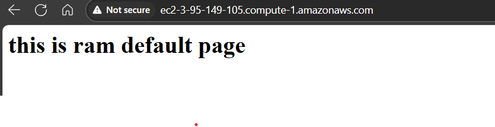

[ramsk@server codebase]$ cat webserver-setup.yaml
---
- name: install apache and expose website
  hosts: cloud
  tasks:
  - name: install apache
    yum:
      name: httpd
      state: present
    become: yes

  - name: copy index.html file
    copy:
      src: index.html
      dest: /var/www/html/index.html
      mode: '777'
    become: yes

  - name: start httpd process
    service:
      name: httpd
      state: started
      enabled: yes
    become: yes

  - name: check process
    shell: |
      ps -ef | grep httpd
      curl http://localhost:80/
    register: shell_output

  - name: show output
    debug:
      var: shell_output

  - name: look at the curl url
    uri:
      url: http://localhost:80/
      return_content: yes
    register: url_op

  - name: show url output
    debug:
      var: url_op.content
[ramsk@server codebase]$

